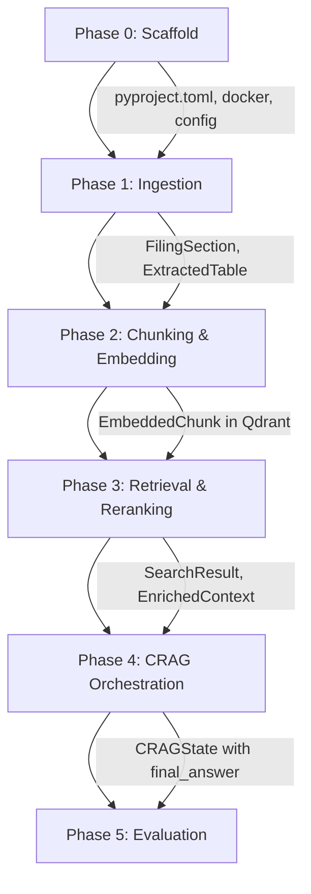

# Finance RAG — Implementation Plan

## Goal

Build an enterprise-grade financial intelligence engine that queries SEC 10-K/10-Q filings using Corrective RAG (CRAG), hybrid dense-sparse search, cross-encoder reranking, and automated LLM-as-a-judge evaluation. All decisions follow the approved [first_principles_analysis.md](file:///C:/Users/Hong/.gemini/antigravity-ide/brain/2eb37f5d-db5d-4f18-a3e2-f3f40ecce705/first_principles_analysis.md).

---

## Project Structure

```
c:\Project\Finance_RAG\
├── pyproject.toml                     # Poetry project config
├── poetry.lock                        # Locked dependencies
├── .env.example                       # Template for API keys
├── .gitignore
├── README.md
├── docker-compose.yml                 # Qdrant local instance
│
├── config/
│   ├── __init__.py
│   └── settings.py                    # Centralized config (Pydantic Settings)
│
├── src/
│   ├── __init__.py
│   │
│   ├── ingestion/                     # Phase 1: Data Ingestion
│   │   ├── __init__.py
│   │   ├── downloader.py              # SEC EDGAR filing downloader
│   │   ├── html_parser.py             # HTML parsing + XBRL stripping
│   │   ├── table_extractor.py         # Table detection, merging, Markdown/HTML conversion
│   │   ├── section_splitter.py        # 10-K section boundary detection (Item 1-8)
│   │   └── xbrl_extractor.py          # GAAP tag whitelist extraction
│   │
│   ├── chunking/                      # Phase 2: Chunking & Embedding
│   │   ├── __init__.py
│   │   ├── chunker.py                 # Section-based chunking orchestrator
│   │   ├── prose_chunker.py           # 512-token prose chunking with overlap
│   │   ├── table_chunker.py           # Table atomic chunking with header injection
│   │   ├── note_chunker.py            # Footnote extraction and chunking
│   │   └── metadata.py                # Chunk metadata schema (Pydantic models)
│   │
│   ├── embedding/                     # Phase 2: Embedding & Indexing
│   │   ├── __init__.py
│   │   ├── embedder.py                # BGE-M3 dense + sparse embedding
│   │   └── indexer.py                 # Qdrant collection setup + upsert
│   │
│   ├── retrieval/                     # Phase 3: Retrieval & Reranking
│   │   ├── __init__.py
│   │   ├── hybrid_search.py           # Qdrant hybrid search with RRF + pre-filtering
│   │   ├── reranker.py                # BGE-reranker-large cross-encoder
│   │   └── parent_expander.py         # Parent chunk expansion by ID
│   │
│   ├── orchestration/                 # Phase 4: CRAG Orchestration
│   │   ├── __init__.py
│   │   ├── state.py                   # LangGraph state definition (TypedDict)
│   │   ├── graph.py                   # LangGraph StateGraph assembly + compile
│   │   ├── nodes/
│   │   │   ├── __init__.py
│   │   │   ├── query_decomposer.py    # Query decomposition + filter extraction
│   │   │   ├── retriever.py           # Retrieval node (calls hybrid_search)
│   │   │   ├── reranker_node.py       # Reranking node (calls reranker)
│   │   │   ├── grader.py              # CRAG document relevance grader (ternary)
│   │   │   ├── generator.py           # Grounded answer generation with citations
│   │   │   ├── query_rewriter.py      # Query rewrite for CRAG correction
│   │   │   ├── hallucination_guard.py # Post-generation faithfulness check
│   │   │   ├── note_expander.py       # Footnote context expansion node
│   │   │   └── calculator.py          # Python REPL for numerical reasoning
│   │   └── prompts/
│   │       ├── __init__.py
│   │       ├── decomposition.py       # Decomposition + filter extraction prompt
│   │       ├── grading.py             # Ternary relevance grading prompt
│   │       ├── generation.py          # Grounded generation + citation prompt
│   │       ├── rewriting.py           # Query rewriting prompt
│   │       └── guardrail.py           # Hallucination check prompt
│   │
│   ├── evaluation/                    # Phase 5: Evaluation
│   │   ├── __init__.py
│   │   ├── benchmarks.py             # FinanceBench + TAT-QA dataset loaders
│   │   ├── ragas_eval.py             # Ragas metric runner
│   │   ├── numeric_eval.py           # Deterministic numeric matching
│   │   └── cost_tracker.py           # Per-query and per-run cost tracking
│   │
│   └── utils/
│       ├── __init__.py
│       ├── logging.py                 # Structured logging setup
│       └── tokens.py                  # Token counting utilities
│
├── scripts/
│   ├── ingest.py                      # CLI: run full ingestion pipeline
│   ├── query.py                       # CLI: interactive query interface
│   └── evaluate.py                    # CLI: run evaluation suite
│
├── notebooks/
│   ├── 01_ingestion_exploration.ipynb
│   ├── 02_chunking_analysis.ipynb
│   ├── 03_retrieval_tuning.ipynb
│   └── 04_evaluation_results.ipynb
│
└── tests/
    ├── __init__.py
    ├── conftest.py                    # Shared fixtures
    ├── test_ingestion/
    │   ├── test_html_parser.py
    │   ├── test_table_extractor.py
    │   └── test_section_splitter.py
    ├── test_chunking/
    │   ├── test_prose_chunker.py
    │   └── test_table_chunker.py
    ├── test_retrieval/
    │   └── test_hybrid_search.py
    └── test_orchestration/
        ├── test_grader.py
        └── test_graph.py
```

---

## Proposed Changes

### Phase 0: Project Scaffold & Infrastructure

> Set up the project skeleton, dependencies, Docker, and configuration before writing any pipeline code.

---

#### [NEW] [pyproject.toml](file:///c:/Project/Finance_RAG/pyproject.toml)

Poetry project configuration with all dependencies pinned to compatible ranges. Dependency groups: `main`, `dev`, `notebook`.

```toml
[tool.poetry]
name = "finance-rag"
description = "Enterprise financial intelligence engine using Corrective RAG for SEC 10-K/10-Q analysis"
version = "0.1.0"
authors = ["Finance RAG Team"]
readme = "README.md"
packages = [{include = "src"}, {include = "config"}]

[tool.poetry.dependencies]
python = "^3.11"

# LLM & Orchestration
langchain-core = ">=0.2,<0.4"
langchain-openai = ">=0.1,<0.3"
langgraph = ">=0.1,<0.3"
openai = "^1.30"

# Embeddings & Reranking
FlagEmbedding = "^1.2"
sentence-transformers = "^3.0"
torch = "^2.3"

# Vector Database
qdrant-client = "^1.9"

# Data Ingestion
sec-edgar-downloader = "^5.0"
beautifulsoup4 = "^4.12"
lxml = "^5.0"

# Evaluation
ragas = ">=0.1,<0.3"
datasets = "^2.19"

# Utilities
pydantic = "^2.7"
pydantic-settings = "^2.3"
python-dotenv = "^1.0"
tiktoken = "^0.7"
rich = "^13.7"

[tool.poetry.group.dev.dependencies]
pytest = "^8.0"
pytest-asyncio = "^0.23"
pytest-cov = "^5.0"
ruff = "^0.4"
mypy = "^1.10"

[tool.poetry.group.notebook.dependencies]
jupyter = "^1.0"
ipywidgets = "^8.0"
matplotlib = "^3.9"

[build-system]
requires = ["poetry-core"]
build-backend = "poetry.core.masonry.api"

[tool.ruff]
target-version = "py311"
line-length = 100

[tool.mypy]
python_version = "3.11"
strict = true
```

---

#### [NEW] [docker-compose.yml](file:///c:/Project/Finance_RAG/docker-compose.yml)

Local Qdrant instance for development.

```yaml
services:
  qdrant:
    image: qdrant/qdrant:latest
    ports:
      - "6333:6333"   # REST API
      - "6334:6334"   # gRPC
    volumes:
      - ./qdrant_data:/qdrant/storage
    environment:
      QDRANT__SERVICE__GRPC_PORT: 6334
    restart: unless-stopped
```

---

#### [NEW] [config/settings.py](file:///c:/Project/Finance_RAG/config/settings.py)

Centralized configuration using Pydantic Settings, loaded from `.env`.

```python
"""Centralized application configuration loaded from environment variables."""
from pydantic_settings import BaseSettings
from pydantic import Field

class Settings(BaseSettings):
    # === OpenAI ===
    openai_api_key: str = Field(..., env="OPENAI_API_KEY")
    openai_model: str = Field(default="gpt-4o", env="OPENAI_MODEL")

    # === Qdrant ===
    qdrant_url: str = Field(default="http://localhost:6333", env="QDRANT_URL")
    qdrant_api_key: str | None = Field(default=None, env="QDRANT_API_KEY")
    qdrant_collection: str = Field(default="sec_filings", env="QDRANT_COLLECTION")

    # === Embedding ===
    embedding_model: str = Field(default="BAAI/bge-m3", env="EMBEDDING_MODEL")
    embedding_dim: int = Field(default=1024, env="EMBEDDING_DIM")
    use_fp16: bool = Field(default=True, env="USE_FP16")

    # === Reranker ===
    reranker_model: str = Field(default="BAAI/bge-reranker-large", env="RERANKER_MODEL")

    # === Retrieval ===
    retrieval_top_k: int = Field(default=25, env="RETRIEVAL_TOP_K")
    rerank_top_k: int = Field(default=5, env="RERANK_TOP_K")
    rerank_top_k_expanded: int = Field(default=8, env="RERANK_TOP_K_EXPANDED")

    # === CRAG ===
    max_crag_cycles: int = Field(default=2, env="MAX_CRAG_CYCLES")

    # === Chunking ===
    prose_chunk_size: int = Field(default=512, env="PROSE_CHUNK_SIZE")
    prose_chunk_overlap: float = Field(default=0.1, env="PROSE_CHUNK_OVERLAP")
    max_table_chunk_tokens: int = Field(default=2048, env="MAX_TABLE_CHUNK_TOKENS")

    # === SEC EDGAR ===
    sec_user_agent_company: str = Field(default="FinanceRAG", env="SEC_USER_AGENT_COMPANY")
    sec_user_agent_email: str = Field(..., env="SEC_USER_AGENT_EMAIL")

    # === Cost Tracking ===
    budget_per_query: float = Field(default=0.10, env="BUDGET_PER_QUERY")
    budget_per_eval_run: float = Field(default=50.0, env="BUDGET_PER_EVAL_RUN")

    model_config = {"env_file": ".env", "env_file_encoding": "utf-8"}

settings = Settings()
```

---

### Phase 1: Data Ingestion Pipeline

> Download SEC 10-K filings, parse HTML, strip XBRL, extract tables, and detect section boundaries. **No LLM calls in this phase — all local CPU.**

---

#### [NEW] [src/ingestion/downloader.py](file:///c:/Project/Finance_RAG/src/ingestion/downloader.py)

Downloads 10-K filings from SEC EDGAR for specified tickers and fiscal years.

**Key Design:**
- Uses `sec-edgar-downloader` to fetch filing HTML.
- Respects SEC rate limits (10 requests/second).
- Stores raw HTML in `data/raw/{ticker}/{filing_type}/{fiscal_year}/` for reproducibility.
- Returns a list of `FilingMetadata` objects (ticker, filing_type, fiscal_year, file_path, filing_date).

**Interface:**
```python
@dataclass
class FilingMetadata:
    ticker: str
    filing_type: str          # "10-K"
    fiscal_year: int
    file_path: Path           # Path to saved HTML
    filing_date: str          # ISO date
    cik: str                  # SEC Central Index Key

class SECDownloader:
    def __init__(self, company: str, email: str): ...
    def download(self, ticker: str, filing_type: str = "10-K", limit: int = 5) -> list[FilingMetadata]: ...
    def download_batch(self, tickers: list[str], ...) -> list[FilingMetadata]: ...
```

---

#### [NEW] [src/ingestion/html_parser.py](file:///c:/Project/Finance_RAG/src/ingestion/html_parser.py)

Parses raw SEC filing HTML, strips XBRL wrapper tags while preserving inner text, and produces a clean HTML DOM.

**Key Design:**
- **XBRL Stripping:** Removes all `<ix:*>`, `<xbrli:*>` tags, schema URLs, and namespace declarations. Preserves inner text content of every stripped tag.
- **CSS/Style Stripping:** Removes all `style`, `class`, `width`, `height`, `bgcolor` attributes. Keeps only semantic HTML (`<table>`, `<tr>`, `<td>`, `<th>`, `<p>`, `<h1>`-`<h4>`, `<b>`, `<i>`).
- **Whitespace Normalization:** Collapses excessive whitespace and `&nbsp;` sequences.
- Returns a `CleanedFiling` object with the cleaned HTML string and extracted metadata.

**Interface:**
```python
@dataclass
class CleanedFiling:
    ticker: str
    fiscal_year: int
    clean_html: str            # Cleaned HTML string
    xbrl_concepts: list[dict]  # Extracted GAAP tags (from xbrl_extractor)
    metadata: FilingMetadata

class HTMLParser:
    def __init__(self, xbrl_extractor: XBRLExtractor): ...
    def parse(self, filing: FilingMetadata) -> CleanedFiling: ...
```

---

#### [NEW] [src/ingestion/xbrl_extractor.py](file:///c:/Project/Finance_RAG/src/ingestion/xbrl_extractor.py)

Extracts whitelisted US-GAAP XBRL concepts from filing HTML before stripping.

**Key Design:**
- Maintains a `GAAP_WHITELIST` of ~50 standard US-GAAP tag names (Revenue, NetIncome, EPS, Assets, etc.).
- Scans `<ix:nonFraction>` and `<ix:nonNumeric>` elements for `name` attributes matching the whitelist.
- Returns a list of `XBRLConcept` with concept name, value, context period, and location in document.
- Runs BEFORE XBRL stripping so tags are still present.

**Interface:**
```python
GAAP_WHITELIST: set[str]  # ~50 standard tags

@dataclass
class XBRLConcept:
    concept: str        # e.g., "us-gaap:Revenues"
    value: str          # e.g., "394328"
    context_ref: str    # e.g., "FD2024Q4YTD"
    unit_ref: str       # e.g., "usd"

class XBRLExtractor:
    def extract(self, html: str) -> list[XBRLConcept]: ...
```

---

#### [NEW] [src/ingestion/table_extractor.py](file:///c:/Project/Finance_RAG/src/ingestion/table_extractor.py)

Detects, merges multi-page tables, and converts them to Markdown or semantic-stripped HTML.

**Key Design:**
- **Table Detection:** Finds all `<table>` elements in cleaned HTML.
- **Header Detection:** Identifies `<thead>` or first `<tr>` with `<th>` elements as header row.
- **Multi-Page Merging:** If two consecutive tables share header rows (>90% fuzzy match on header text), merge their body rows into a single logical table.
- **Format Conversion:**
  - Simple tables (no `colspan`/`rowspan`) → Markdown pipe tables.
  - Complex tables (any `colspan > 1` or `rowspan > 1`) → Semantic-stripped HTML (only `<table>`, `<tr>`, `<td>`, `<th>`, `colspan`, `rowspan` attributes preserved).
- **Table Metadata:** Each extracted table gets an ID, title (from preceding heading), row count, and format type.

**Interface:**
```python
@dataclass
class ExtractedTable:
    table_id: str              # e.g., "AAPL_10K_2024_table_3"
    title: str                 # From preceding <h2>/<h3> or caption
    content: str               # Markdown or stripped HTML
    format_type: str           # "markdown" | "html_fallback"
    header_row: str            # Header text for injection
    row_count: int
    has_complex_structure: bool # colspan/rowspan present
    position_in_doc: int       # Character offset in source HTML

class TableExtractor:
    def extract_tables(self, clean_html: str, ticker: str, fiscal_year: int) -> list[ExtractedTable]: ...
    def _detect_header(self, table_element) -> str | None: ...
    def _should_merge(self, table_a, table_b) -> bool: ...
    def _to_markdown(self, table_element) -> str: ...
    def _to_stripped_html(self, table_element) -> str: ...
    def _needs_html_fallback(self, table_element) -> bool: ...
```

---

#### [NEW] [src/ingestion/section_splitter.py](file:///c:/Project/Finance_RAG/src/ingestion/section_splitter.py)

Splits a cleaned 10-K filing into SEC-mandated sections (Item 1 through Item 15).

**Key Design:**
- Uses regex patterns on heading elements to detect section boundaries:
  ```
  Item 1: Business
  Item 1A: Risk Factors
  Item 7: MD&A
  Item 8: Financial Statements and Supplementary Data
  Item 8 Notes: Notes to Consolidated Financial Statements
  ```
- Each section is tagged with its type and content category (`prose` vs. `financial_statements` vs. `notes`).
- The Notes section is further sub-split into individual Notes using `Note \d+` heading patterns.

**Interface:**
```python
@dataclass
class FilingSection:
    section_id: str         # e.g., "item7_mda"
    section_name: str       # e.g., "Management's Discussion and Analysis"
    content_type: str       # "prose" | "financial_statements" | "notes"
    html_content: str       # Raw HTML content of this section
    tables: list[ExtractedTable]  # Tables found within this section
    start_position: int
    end_position: int

class SectionSplitter:
    SECTION_PATTERNS: dict[str, str]  # regex patterns for each Item
    def split(self, clean_html: str, tables: list[ExtractedTable]) -> list[FilingSection]: ...
```

---

### Phase 2: Chunking, Embedding & Indexing

> Transform sections into self-contained chunks, generate dense+sparse embeddings, and index into Qdrant.

---

#### [NEW] [src/chunking/metadata.py](file:///c:/Project/Finance_RAG/src/chunking/metadata.py)

Pydantic models for chunk metadata — the data contract between ingestion and retrieval.

```python
from pydantic import BaseModel

class ChunkMetadata(BaseModel):
    """Metadata attached to every chunk stored in Qdrant."""
    # === Indexed fields (used for pre-filtering) ===
    company_ticker: str           # "AAPL"
    filing_type: str              # "10-K"
    fiscal_year: int              # 2024
    section: str                  # "item8_financial_statements"
    chunk_type: str               # "child" | "parent"

    # === Unindexed payload fields ===
    company_name: str
    filing_date: str
    section_title: str
    page_number: int | None = None
    table_id: str | None = None
    parent_chunk_id: str | None = None
    chunk_id: str                 # Unique identifier
    referenced_notes: list[str] = []
    xbrl_concepts: list[str] = []
    table_format: str | None = None  # "markdown" | "html_fallback"
    token_count: int
    content_type: str             # "prose" | "table" | "note"
```

---

#### [NEW] [src/chunking/prose_chunker.py](file:///c:/Project/Finance_RAG/src/chunking/prose_chunker.py)

Chunks prose sections (MD&A, Risk Factors, Business) into ~512-token segments.

**Key Design:**
- Splits on paragraph boundaries (`<p>` tags) first.
- If a paragraph exceeds 800 tokens, splits on sentence boundaries (using regex for `.`, `!`, `?` followed by space + capital letter).
- Never splits mid-sentence.
- 10% overlap (~50 tokens) between adjacent chunks for boundary context.
- Detects footnote references (`See Note \d+`, `Refer to Note \d+`) via regex and stores in `referenced_notes` metadata.

**Interface:**
```python
@dataclass
class Chunk:
    chunk_id: str
    text: str
    metadata: ChunkMetadata

class ProseChunker:
    def __init__(self, target_tokens: int = 512, overlap_ratio: float = 0.1): ...
    def chunk(self, section: FilingSection, filing_meta: dict) -> list[Chunk]: ...
    def _detect_note_references(self, text: str) -> list[str]: ...
```

---

#### [NEW] [src/chunking/table_chunker.py](file:///c:/Project/Finance_RAG/src/chunking/table_chunker.py)

Chunks tables as atomic units with parent-child hierarchy and header injection.

**Key Design:**
- **Small tables (<2048 tokens):** Single chunk = the full table. Both parent and child point to same content.
- **Large tables (>2048 tokens):** Parent = full table (stored for expansion, no embedding). Children = row-group segments (~512-1024 tokens each) with header row prepended.
- **Header Injection:** Every child chunk starts with the table header row so column labels are always present.
- **Table title context:** Prepends the section heading and table title (e.g., `"## Consolidated Statements of Operations\n\n"`) to every chunk.

**Interface:**
```python
class TableChunker:
    def __init__(self, max_child_tokens: int = 1024): ...
    def chunk(self, table: ExtractedTable, section: FilingSection, filing_meta: dict) -> list[Chunk]: ...
    def _split_large_table(self, table: ExtractedTable) -> list[str]: ...
    def _inject_header(self, header: str, body_segment: str) -> str: ...
```

---

#### [NEW] [src/chunking/note_chunker.py](file:///c:/Project/Finance_RAG/src/chunking/note_chunker.py)

Extracts and chunks individual footnotes from Item 8 Notes section.

**Key Design:**
- Detects Note boundaries using heading patterns (`Note 1`, `Note 2`, etc.).
- Each Note becomes a parent chunk with metadata: `note_id`, `note_title`.
- If a Note exceeds 2048 tokens, sub-chunk into prose segments.
- Note chunks are retrievable by both vector search AND exact `note_id` metadata lookup (for the agentic expansion in Phase 4).

---

#### [NEW] [src/chunking/chunker.py](file:///c:/Project/Finance_RAG/src/chunking/chunker.py)

Orchestrator that routes each section to the appropriate chunker.

```python
class ChunkingPipeline:
    def __init__(self, prose_chunker: ProseChunker, table_chunker: TableChunker,
                 note_chunker: NoteChunker): ...

    def process_filing(self, sections: list[FilingSection], filing_meta: dict) -> list[Chunk]:
        """Routes sections to appropriate chunkers and returns all chunks."""
        chunks = []
        for section in sections:
            if section.content_type == "prose":
                chunks.extend(self.prose_chunker.chunk(section, filing_meta))
            elif section.content_type == "financial_statements":
                for table in section.tables:
                    chunks.extend(self.table_chunker.chunk(table, section, filing_meta))
                # Also chunk any inter-table prose
                ...
            elif section.content_type == "notes":
                chunks.extend(self.note_chunker.chunk(section, filing_meta))
        return chunks
```

---

#### [NEW] [src/embedding/embedder.py](file:///c:/Project/Finance_RAG/src/embedding/embedder.py)

Generates dense (1024-dim) and sparse (lexical weight) embeddings using BGE-M3.

**Key Design:**
- Uses `FlagEmbedding.BGEM3FlagModel` (not `sentence-transformers`) for native dense + sparse output in a single forward pass.
- Batch encoding with configurable batch size (default: 32).
- For parent chunks with `chunk_type == "parent"`, skip embedding entirely (parents are fetched by ID, not vector search).
- For child chunks, embed only the first 512 tokens for dense vector; use full text for sparse weights.
- Returns `EmbeddedChunk` with dense vector, sparse indices/values, and original chunk.

**Interface:**
```python
@dataclass
class EmbeddedChunk:
    chunk: Chunk
    dense_vector: list[float]           # 1024-dim
    sparse_indices: list[int]           # Token indices
    sparse_values: list[float]          # Lexical weights

class BGEEmbedder:
    def __init__(self, model_name: str = "BAAI/bge-m3", use_fp16: bool = True): ...
    def embed_chunks(self, chunks: list[Chunk]) -> list[EmbeddedChunk]: ...
    def embed_query(self, query: str) -> tuple[list[float], dict[int, float]]: ...
```

---

#### [NEW] [src/embedding/indexer.py](file:///c:/Project/Finance_RAG/src/embedding/indexer.py)

Creates the Qdrant hybrid collection and upserts embedded chunks.

**Key Design:**
- **Collection Schema:**
  - Dense vector: `"dense"`, 1024-dim, Cosine distance.
  - Sparse vector: `"sparse"`, `SparseVectorParams`.
- **Payload Indexes:** Creates indexes on 5 filter fields: `company_ticker`, `filing_type`, `fiscal_year`, `section`, `chunk_type`.
- **Upsert:** Batched upsert of points with dense vector, sparse vector, and full metadata payload.
- **Parent Chunks:** Stored as payload-only points (no vectors) — used for ID-based expansion, not search.

**Interface:**
```python
class QdrantIndexer:
    def __init__(self, url: str, collection_name: str, api_key: str | None = None): ...
    def create_collection(self) -> None: ...
    def _create_payload_indexes(self) -> None: ...
    def upsert_chunks(self, embedded_chunks: list[EmbeddedChunk]) -> None: ...
    def upsert_parent_chunks(self, parent_chunks: list[Chunk]) -> None: ...
    def get_chunk_by_id(self, chunk_id: str) -> dict | None: ...
```

---

### Phase 3: Retrieval & Reranking

> Hybrid search with RRF fusion, cross-encoder reranking, and parent chunk expansion.

---

#### [NEW] [src/retrieval/hybrid_search.py](file:///c:/Project/Finance_RAG/src/retrieval/hybrid_search.py)

Performs hybrid dense+sparse search on Qdrant with pre-filtering and RRF fusion.

**Key Design:**
- Uses Qdrant's `query_points` API with `prefetch` for server-side RRF fusion.
- Pre-filter construction from structured filters (extracted by query decomposer):
  ```python
  Filter(must=[
      FieldCondition(key="company_ticker", match=MatchValue(value="AAPL")),
      FieldCondition(key="fiscal_year", match=MatchValue(value=2024)),
  ])
  ```
- Returns top-25 candidates (configurable via `settings.retrieval_top_k`).
- Excludes `chunk_type == "parent"` from search results (parents are expansion-only).

**Interface:**
```python
@dataclass
class SearchResult:
    chunk_id: str
    text: str
    metadata: dict
    score: float              # RRF fusion score

class HybridSearcher:
    def __init__(self, client: QdrantClient, embedder: BGEEmbedder,
                 collection: str): ...
    def search(self, query: str, filters: dict | None = None,
               top_k: int = 25) -> list[SearchResult]: ...
    def _build_qdrant_filter(self, filters: dict) -> Filter | None: ...
```

---

#### [NEW] [src/retrieval/reranker.py](file:///c:/Project/Finance_RAG/src/retrieval/reranker.py)

Cross-encoder reranking using BGE-reranker-large.

**Key Design:**
- Uses `FlagEmbedding.FlagReranker` for cross-encoder scoring.
- Scores all query-document pairs, sorts by score descending, returns top-K.
- Supports per-sub-query reranking with merge+dedup (for decomposed queries).

**Interface:**
```python
class CrossEncoderReranker:
    def __init__(self, model_name: str = "BAAI/bge-reranker-large", use_fp16: bool = True): ...
    def rerank(self, query: str, candidates: list[SearchResult],
               top_k: int = 5) -> list[SearchResult]: ...
    def rerank_multi_query(self, sub_queries: list[str],
                           candidates_per_query: list[list[SearchResult]],
                           top_k: int = 5) -> list[SearchResult]: ...
```

---

#### [NEW] [src/retrieval/parent_expander.py](file:///c:/Project/Finance_RAG/src/retrieval/parent_expander.py)

Expands child chunks to their parent context for richer generation input.

**Key Design:**
- For each top-K reranked child chunk, fetch `parent_chunk_id` from metadata.
- Retrieve parent chunk text from Qdrant by ID (exact payload lookup, no vector search).
- Deduplicate parents (multiple children may share the same parent).
- Returns enriched context: list of `{child_text, parent_text, metadata}`.

**Interface:**
```python
@dataclass
class EnrichedContext:
    child_text: str
    parent_text: str | None
    metadata: dict
    rerank_score: float

class ParentExpander:
    def __init__(self, client: QdrantClient, collection: str): ...
    def expand(self, reranked_results: list[SearchResult]) -> list[EnrichedContext]: ...
```

---

### Phase 4: CRAG Orchestration (LangGraph)

> The core intelligence layer: query decomposition, retrieval, grading, self-correction, generation, and guardrails — all wired as a LangGraph state machine.

---

#### [NEW] [src/orchestration/state.py](file:///c:/Project/Finance_RAG/src/orchestration/state.py)

LangGraph state definition — the data contract flowing through all nodes.

```python
from typing import TypedDict, Literal

class CRAGState(TypedDict):
    # === Input ===
    original_query: str

    # === Query Processing ===
    sub_queries: list[str]
    structured_filters: dict        # e.g., {"company_ticker": "AAPL", "fiscal_year": 2024}
    query_type: str                 # "factual_numeric" | "conceptual" | "comparative"
    result_count: int               # Adaptive: 5 or 8

    # === Retrieval ===
    search_results: list[dict]      # Raw hybrid search results
    reranked_results: list[dict]    # After cross-encoder
    enriched_contexts: list[dict]   # After parent expansion + note expansion

    # === CRAG ===
    grading_results: list[dict]     # Per-chunk relevance grades
    cycle_count: int                # 0, 1, or 2 (max)
    confidence: str                 # "high" | "medium" | "low" | "insufficient"
    crag_action: str                # "generate" | "rewrite" | "fallback" | "refuse"
    rewritten_query: str | None

    # === Generation ===
    generation: str | None          # Final answer text
    citations: list[dict]           # Structured citations
    structured_metrics: list[dict] | None  # Optional structured output

    # === Guardrails ===
    hallucination_check: str        # "pass" | "fail"
    final_answer: str | None        # Post-guardrail answer

    # === Cost ===
    cost_accumulated: float         # Running cost in USD
```

---

#### [NEW] [src/orchestration/graph.py](file:///c:/Project/Finance_RAG/src/orchestration/graph.py)

LangGraph StateGraph assembly — wires all nodes with conditional routing.

**Graph Topology:**
```
START
  │
  ▼
query_decomposer ──────────────────────────────────────┐
  │                                                     │
  ▼                                                     │
retriever (hybrid search)                               │
  │                                                     │
  ▼                                                     │
reranker_node (cross-encoder)                           │
  │                                                     │
  ▼                                                     │
note_expander (conditional: if referenced_notes exist)  │
  │                                                     │
  ▼                                                     │
grader (ternary relevance grading)                      │
  │                                                     │
  ├── crag_action == "generate" ──► generator ──► hallucination_guard ──► END
  │                                                     │
  ├── crag_action == "rewrite" AND cycle_count < 2      │
  │   └──► query_rewriter ──► retriever (loop back) ───►┘
  │                                                     │
  └── crag_action == "refuse" ──► refuse_node ──► END
```

**Key Implementation:**
```python
from langgraph.graph import StateGraph, END

def build_crag_graph(
    searcher: HybridSearcher,
    reranker: CrossEncoderReranker,
    expander: ParentExpander,
    # ... other dependencies
) -> StateGraph:
    workflow = StateGraph(CRAGState)

    # Add nodes
    workflow.add_node("decompose", query_decomposer_node)
    workflow.add_node("retrieve", retriever_node)
    workflow.add_node("rerank", reranker_node)
    workflow.add_node("expand_notes", note_expander_node)
    workflow.add_node("grade", grader_node)
    workflow.add_node("generate", generator_node)
    workflow.add_node("guard", hallucination_guard_node)
    workflow.add_node("rewrite", query_rewriter_node)
    workflow.add_node("refuse", refuse_node)

    # Wire edges
    workflow.set_entry_point("decompose")
    workflow.add_edge("decompose", "retrieve")
    workflow.add_edge("retrieve", "rerank")
    workflow.add_edge("rerank", "expand_notes")
    workflow.add_edge("expand_notes", "grade")

    # Conditional routing after grading
    workflow.add_conditional_edges("grade", route_after_grading, {
        "generate": "generate",
        "rewrite": "rewrite",
        "refuse": "refuse",
    })

    workflow.add_edge("generate", "guard")
    workflow.add_conditional_edges("guard", route_after_guard, {
        "pass": END,
        "fail": "rewrite",  # Regenerate on hallucination
    })

    workflow.add_edge("rewrite", "retrieve")  # CRAG loop
    workflow.add_edge("refuse", END)

    return workflow.compile()
```

---

#### [NEW] [src/orchestration/nodes/query_decomposer.py](file:///c:/Project/Finance_RAG/src/orchestration/nodes/query_decomposer.py)

Decomposes complex queries into sub-queries and extracts structured metadata filters.

**Key Design:**
- Single GPT-4o call that returns:
  1. `sub_queries`: list of focused retrieval queries (max 5).
  2. `structured_filters`: extracted metadata constraints (ticker, year, filing type).
  3. `query_type`: classification for downstream adaptive behavior.
  4. `result_count`: 5 (default) or 8 (for multi-entity/multi-year).
- Simple queries (single entity, single metric) bypass decomposition — the original query is used as-is.
- Uses JSON mode for structured output.

**Prompt Strategy:**
```
You are a financial query analyzer. Given a user question about SEC filings:
1. Decompose into focused sub-queries (max 5). For simple queries, return the original query.
2. Extract structured filters: company_ticker, fiscal_year, filing_type.
3. Classify query type: factual_numeric, conceptual, or comparative.
4. Set result_count: 5 for simple queries, 8 for multi-entity or multi-year.

Decompose by ENTITY, not by entity×year. Example:
"Compare Apple and Microsoft revenue 2022-2024" →
  ["Apple total revenue 2022 2023 2024", "Microsoft total revenue 2022 2023 2024"]
NOT:
  ["Apple revenue 2022", "Apple revenue 2023", ..., "Microsoft revenue 2024"]
```

---

#### [NEW] [src/orchestration/nodes/grader.py](file:///c:/Project/Finance_RAG/src/orchestration/nodes/grader.py)

CRAG document relevance grader — ternary grading in a single batch call.

**Key Design:**
- Grades ALL reranked chunks (top-5 or top-8) in a single GPT-4o call using JSON mode.
- Ternary schema: `relevant` / `partially_relevant` / `irrelevant` with one-sentence reason.
- Action routing logic:
  | Grade Distribution | Action |
  |---|---|
  | ≥3 relevant | → `generate` (high confidence) |
  | 1-2 relevant + ≥1 partially_relevant | → `generate` (medium confidence) |
  | 0 relevant, ≥2 partially_relevant | → `rewrite` (CRAG cycle) |
  | All irrelevant OR cycle_count ≥ max | → `refuse` |
- On `rewrite`: if this is Cycle 2 (last cycle), relaxes filters (removes fiscal_year, broadens section) before re-retrieving.

---

#### [NEW] [src/orchestration/nodes/generator.py](file:///c:/Project/Finance_RAG/src/orchestration/nodes/generator.py)

Grounded answer generation with citations and optional structured metrics.

**Key Design:**
- Receives enriched context (child text + parent text) and confidence level.
- Generates answer with numbered citations `[1]`, `[2]`, etc.
- Every financial number MUST have a citation. If unsourced, the prompt instructs: `"Say 'I could not verify this figure.'"`
- Confidence level is embedded in the response: `[HIGH CONFIDENCE]`, `[MEDIUM CONFIDENCE]`, or `[LOW CONFIDENCE]`.
- Optionally extracts structured metrics into JSON.
- Uses `gpt-4o` with temperature 0 for deterministic financial output.

**Citation Format:**
```
[1] Apple Inc. 10-K (FY2024), Item 8: Consolidated Statements of Operations
    Evidence: "Net sales: $394,328 (in millions)"
```

---

#### [NEW] [src/orchestration/nodes/hallucination_guard.py](file:///c:/Project/Finance_RAG/src/orchestration/nodes/hallucination_guard.py)

Post-generation faithfulness verification.

**Key Design:**
- Fast GPT-4o call (~100 output tokens) comparing the generated answer against the source context.
- Prompt: `"Does the following answer contain any claims NOT supported by the provided context? Answer 'pass' or 'fail' with a brief explanation."`
- On `fail`: routes back to `rewrite` node (counts as a CRAG cycle). If cycle budget exhausted, adds `[UNVERIFIED]` tags to unsupported claims and returns.
- Cost: ~$0.001 per check — cheapest insurance against hallucination.

---

#### [NEW] [src/orchestration/nodes/calculator.py](file:///c:/Project/Finance_RAG/src/orchestration/nodes/calculator.py)

Python REPL tool for numerical reasoning.

**Key Design:**
- Sandboxed `eval()` with only `math` and `Decimal` in scope.
- Called by the generator node when computation keywords are detected (CAGR, growth rate, percentage change, ratio).
- The generator formulates the expression; the calculator executes it.
- Result is injected back into the generation context.

---

#### [NEW] [src/orchestration/nodes/note_expander.py](file:///c:/Project/Finance_RAG/src/orchestration/nodes/note_expander.py)

Conditional footnote expansion — fetches referenced Notes from Qdrant.

**Key Design:**
- Scans `referenced_notes` metadata of reranked chunks.
- For each referenced Note ID (e.g., `"Note 12"`), performs a metadata-filtered Qdrant lookup:
  ```python
  Filter(must=[
      FieldCondition(key="section", match=MatchValue(value="notes")),
      # Match on note_id in payload
  ])
  ```
- Appends fetched Note text to enriched context with label: `[Appended Context: Note 12 — Segment Reporting]`.
- **Conditional node:** Only executes if any chunk has non-empty `referenced_notes`. Otherwise, passes through.

---

### Phase 5: Evaluation & Benchmarking

> Automated evaluation using Ragas metrics, FinanceBench, TAT-QA, and cost tracking.

---

#### [NEW] [src/evaluation/benchmarks.py](file:///c:/Project/Finance_RAG/src/evaluation/benchmarks.py)

Dataset loaders for FinanceBench and TAT-QA.

**Key Design:**
- **FinanceBench:** Loads from `PatronusAI/financebench` via HuggingFace `datasets`. Maps columns to standard schema: `question`, `ground_truth_answer`, `evidence_text`.
- **TAT-QA:** Loads from `next-tat/TAT-QA`. Filters to SEC-relevant questions. Classifies by operation type: `extraction`, `arithmetic`, `multi_step`.
- **Dev/Eval Split:** Stratified random split (20%/80%) with fixed seed for reproducibility.

---

#### [NEW] [src/evaluation/ragas_eval.py](file:///c:/Project/Finance_RAG/src/evaluation/ragas_eval.py)

Ragas metric runner with cost tracking.

**Key Design:**
- Runs the full CRAG pipeline on evaluation questions, captures: `question`, `answer`, `contexts`, `ground_truth`.
- Evaluates with Ragas metrics: `faithfulness`, `context_precision`, `answer_relevancy`, `context_recall`.
- Hard gate logic: if `faithfulness < 0.95`, flags as FAIL.
- Outputs results as CSV + JSON for analysis.

---

#### [NEW] [src/evaluation/numeric_eval.py](file:///c:/Project/Finance_RAG/src/evaluation/numeric_eval.py)

Deterministic numerical matching for TAT-QA (bypasses LLM judge for numbers).

```python
def numeric_match(predicted: str, expected: str, tolerance: float = 0.01) -> bool:
    """Compare financial numbers with tolerance for formatting differences."""
    pred_num = parse_financial_number(predicted)   # Handles "$394.3B", "394,328 million", etc.
    exp_num = parse_financial_number(expected)
    if pred_num is None or exp_num is None:
        return False
    return abs(pred_num - exp_num) / max(abs(exp_num), 1e-9) <= tolerance
```

---

#### [NEW] [src/evaluation/cost_tracker.py](file:///c:/Project/Finance_RAG/src/evaluation/cost_tracker.py)

Per-query and per-run cost tracking for OpenAI API usage.

**Key Design:**
- Hooks into every OpenAI call to log `input_tokens`, `output_tokens`, `model`, `cost`.
- Enforces budget caps: `budget_per_query` (default $0.10) and `budget_per_eval_run` (default $50).
- Raises `BudgetExceededError` if a single query or full run exceeds its budget.
- Generates cost reports: per-query breakdown, per-node breakdown (decomposition vs. grading vs. generation).

---

### CLI Scripts

#### [NEW] [scripts/ingest.py](file:///c:/Project/Finance_RAG/scripts/ingest.py)

End-to-end ingestion CLI: download → parse → chunk → embed → index.

```bash
python scripts/ingest.py --tickers AAPL MSFT NVDA AMZN --filing-type 10-K --limit 3
```

#### [NEW] [scripts/query.py](file:///c:/Project/Finance_RAG/scripts/query.py)

Interactive query interface with rich terminal output.

```bash
python scripts/query.py "What was Apple's total revenue in FY2024?"
```

#### [NEW] [scripts/evaluate.py](file:///c:/Project/Finance_RAG/scripts/evaluate.py)

Run evaluation suite against FinanceBench and TAT-QA.

```bash
python scripts/evaluate.py --dataset financebench --split dev --output results/
```

---

## Verification Plan

### Automated Tests

```bash
# Phase 1: Ingestion tests (mock HTML fixtures)
poetry run pytest tests/test_ingestion/ -v

# Phase 2: Chunking tests (verify token counts, metadata, parent-child links)
poetry run pytest tests/test_chunking/ -v

# Phase 3: Retrieval tests (requires Qdrant Docker running)
docker compose up -d
poetry run pytest tests/test_retrieval/ -v

# Phase 4: Orchestration tests (mock LLM responses)
poetry run pytest tests/test_orchestration/ -v

# Full suite
poetry run pytest --cov=src --cov-report=term-missing
```

### Integration Verification

| Phase | Verification Step | Pass Criteria |
|-------|-------------------|---------------|
| P0 | `poetry install` succeeds | All deps resolve without conflict |
| P0 | `docker compose up -d` starts Qdrant | Port 6333 responds to health check |
| P1 | Ingest 1 filing (AAPL 10-K 2024) | HTML downloaded, parsed, sections split, tables extracted |
| P2 | Chunk + embed + index 1 filing | Chunks visible in Qdrant dashboard (localhost:6333/dashboard) |
| P3 | Run a sample query against indexed data | Returns relevant chunks with scores |
| P4 | Run full CRAG pipeline on 5 test questions | Answers with citations, no crashes, CRAG loop stays ≤2 cycles |
| P5 | Run dev eval (30 questions) | Faithfulness ≥ 0.90, full report generated |

### Manual Verification

- Spot-check 10 random chunks from Qdrant dashboard to verify:
  - Table chunks have header rows injected.
  - Metadata fields are correctly populated.
  - Parent-child linkage is consistent.
- Run 5 comparative queries (multi-company) end-to-end and verify:
  - Citations trace back to correct source documents.
  - Numerical calculations are accurate.
  - "I don't know" triggers appropriately when data is absent.

---

## Build Order & Dependencies



Each phase is independently testable. Phase N can be verified before starting Phase N+1.

> [!IMPORTANT]
> Please review this implementation plan. Once approved, I will begin execution starting with Phase 0 (project scaffold) and proceed phase by phase.
